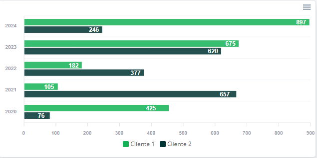

# INTEGRANDO APEX CHARTS A LARAVEL 10 Y LIVEWIRE 3

### [Arthuro Dugarte](https://github.com/ArtDugarte)

#### Requisitos Previos:

-   LARAVEL 10
-   LIVEWIRE 3
-   PHP ^8.1
-   BOOTSTRAP ^5
-   Alguna librería de iconos (por ejemplo, font-awesome o la librería de iconos de Cartzilla)

## Pasos Para La Integración

-   Instalar APEX CHARTS con el comando `npm install apexcharts --save`
-   Correr la aplicación con el comando `php artisan serve` o `npm run dev`

## Pasos Para La Implementación de los Diferentes Charts

- ### Área Chart:

     <div style="text-align: center;">
         
     </div>

    - Generar el componente de Livewire según la documentación.
    - Crear un Archivo JS dentro de la carpeta `resources/js`. Por ejemplo, `resources/js/area-chart.js`
    - Dentro de el archivo `resources/views/livewire/area-chart.blade.php` (O la ruta correspondiente para el archivo .blade.php del componente), introducir la siguiente estructura:

        `<div id="line-chart" data-series="{{ json_encode($series) }}" data-categories="{{ json_encode($categories) }}"></div>`
        <br />
        <br />
        `@vite(['resources/js/area-chart.js'])`

    - Dentro del archivo ubicado en la ruta `app/Livewire/AreaChart.php` (O la ruta correspondiente para el archivo .php del componente), introducir la estructura encontrada dentro de [Area Chart](./app/Livewire/AreaChart.php)
    - Dentro del archivo `resources/js/area-chart.js` (O la ruta correspondiente para el archivo .js del componente), introducir la siguiente funcionalidad ubicad dentro de el archivo [Area Chart](./resources/js/area-chart.js)
    - Llamar el componente `area-chart.blade.php`(O la ruta correspondiente para el archivo .blade.php del componente) en donde sea requerida su funcionalidad.

    ### NOTA: se debe agregar `type="graph-partial"` al llamar al componente Livewire si se desea utilizar un gráfico parcial del año actual que vaya desde Enero hasta Diciembre del año en curso. Este gráfico mostrara los datos solamente hasta el mes que está transcurriendo.

     <div style="text-align: center;">
     
 </div>

- ### Bar Chart:

 <div style="text-align: center;">
     
 </div>

-   Generar el componente de Livewire por medio de la documentación.
-   Crear un Archivo JS dentro de la carpeta `resources/js`. Por ejemplo, `resources/js/bar-chart.js`
-   Dentro de el archivo `resources/views/livewire/bar-chart.blade.php` (O la ruta correspondiente para el archivo .blade.php del componente), introducir la siguiente estructura:
    `<div id="bar-chart" data-series="{{ json_encode($series) }}" data-categories="{{ json_encode($categories) }}"></div>`
    <br />
    <br />
    `@vite(['resources/js/bar-chart.js'])`

-   Dentro del archivo ubicado en la ruta `app/Livewire/BarChart.php` (O la ruta correspondiente para el archivo .php del componente), introducir la estructura encontrada dentro de [Bar Chart](./app/Livewire/BarChart.php)
-   Dentro del archivo `resources/js/bar-chart.js` (O la ruta correspondiente para el archivo .js del componente), introducir la siguiente funcionalidad dentro de el archivo [Bar Chart](./resources/js/bar-chart.js)
-   Llamar el componente `bar-chart.blade.php`(O la ruta correspondiente para el archivo .blade.php del componente) en donde sea requerida su funcionalidad.

- ### Custom Bar Chart:

 <div style="text-align: center;">
     
 </div>

-   Generar el componente de Livewire por medio de la documentación.
-   Crear un Archivo JS dentro de la carpeta `resources/js`. Por ejemplo, `resources/js/bar-curstom-chart.js`
-   Dentro de el archivo `resources/views/livewire/bar-custom-chart.blade.php` (O la ruta correspondiente para el archivo .blade.php del componente), introducir la siguiente estructura:
    `<div id="bar-custom-chart" data-series="{{ json_encode($series) }}" data-categories="{{ json_encode($categories) }}"></div>`
    <br />
    <br />
    `@vite(['resources/js/bar-curstom-chart.js'])`

-   Dentro del archivo ubicado en la ruta `app/Livewire/BarCustomChart.php` (O la ruta correspondiente para el archivo .php del componente), introducir la estructura encontrada dentro de [Bar Chart](./app/Livewire/BarCustomChart.php)
-   Dentro del archivo `resources/js/bar-curstom-chart.js` (O la ruta correspondiente para el archivo .js del componente), introducir la siguiente funcionalidad dentro de el archivo [Bar Chart](./resources/js/bar-curstom-chart.js)
-   Llamar el componente `bar-custom-chart.blade.php`(O la ruta correspondiente para el archivo .blade.php del componente) en donde sea requerida su funcionalidad.

## EDITAR LOS ESTILOS DE LOS CHARTS Y PASO DE PARAMETROS A SU USO

-   En los archivos dentro de la carpeta `app/Livewire` de momento no se están pasando datos provenientes de una base de datos. Por lo tanto, deben hacerse los cambios correspondientes dentro de los archivos correspondientes, agregando consultas. Sin embargo, las variables donde se guardan los datos pueden conservarse para no tener que cambiar dichos datos en el blade.php o en el JS.

#### Editando los Archivos .JS para personalizar los Charts.

-   El cambio de colores se realiza en la línea: `colors: []` del archivo JS de cada componente. Allí, se recibe un arreglo de n colores. Por ejemplo, `colors: ["#ff0000", "#00ff00", "#0000ff"]`. Si existen más datos por mostrar que colores, los colores cada n datos, volverán a mostrarse desde la posición 0 del arreglo.
-   El cambio de tamaño del chart se realiza en la línea: `height: ${number}` del archivo JS de cada componente.
-   Toolbar en Español:
    -   `import es from "apexcharts/dist/locales/es.json";` en la parte superior del archivo, luego de importar la librería de apexcharts.
    -   Agregar lo siguiente al atributo Chart
        `chart: {
      locales: [es],
      defaultLocale: "es"
  },`
- Puede cambiarse la FontFamily de varias áreas del Chart usando `fontFamily: "Open Sans, Nunito, sans-serif"`. (La fuente a utilizar debe estar incluida en el proyecto).
- Otras modificaciones y personalizaciones de estilos pueden ser realizadas directamente en el archivo JS utilizando la documentación de ApexCharts que se encuentra en [Documentación](https://apexcharts.com/docs/options/annotations/).

## EXTRA: Bootstrap Personalized Stats Cards

<div style="text-align: center;">
    
</div>

<div style="text-align: center;">
    
</div>

- Se debe crear el componente de Livewire por medio de la documentación.
- El código para el Componente stat-card puede ser encontrado en [Stat Card](./resources/livewire/stat-card.blade.php). Dicho componente una carta individual que recibe como párametros los datos que se requieren mostrar en la tarjeta. De momento, se tiene title, value, quantity, color, url e icon.
- Dichos paramétros debes ser declarados en el archivo dentro de la carpeta `app/Livewire/StatCard.php`. Por ejemplo:
<br/><br/>
```
public $title;
public $value;
public $quantity;
public $color;
public $url;
public $icon;
```

- Para utilizar el componente, se deben pasar los parametros de la siguiente manera: ``<livewire:stat-card title="Aseo Urbano" value="26" quantity="+7" color="#13b256" icon="trash"/>``
